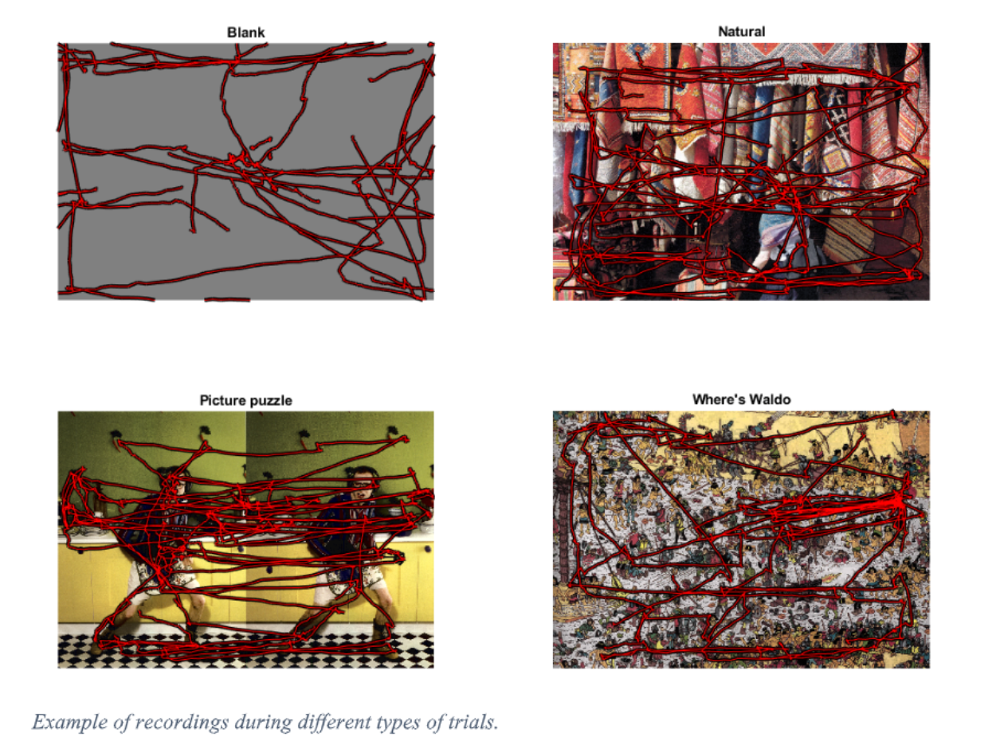

# Visual Stimuli Classification Using Universal Time Series Classification Techniques

David Nepožitek

---

## Problem Definition
The goal of this experiment is to predict classes of visual stimuli based on eye tracking data (eye movement and pupil size in our case) that was recorded when presenting a particular stimulus. The final model should be able to learn characteristics of each stimuli class from training data. Then, it should recognize the class of a stimulus for trials of people that were not present in the training phase.

## Data Description
We use ETRA challenge dataset that is described by  Otero-Millan et al.[^1] and McCamy et al.[^2] in detail. The dataset consists of 960 trials where a certain visual stimulus was presented to a subject which was asked to perform one of two tasks. The data was collected from 8 subjects, each trial lasted 45 seconds. One of the tasks is a fixation where the subjects were asked to focus on a certain point in the image. The other task is a free viewing,  this task differs depending on the stimulus. The stimuli are divided into four classes with the following free viewing objectives:

1. __Blank__ stimulus is a monocolor grey image. The subjects were asked to view this picture arbitrarily.
2. __Natural__ stimuli are regular real-life photos such as photos of kids or animals. The subjects were asked to explore the scene.
3. __Puzzle__ stimuli are images divided in half, where both halves present a similar scene with a few differences. The subjects were asked to find these differences.
4. __Where's Waldo__ stimuli are images from the book Where's Waldo. The subjects were asked to find Waldo and other relevant objects.

The subjects were presented 15 images for each class except for the blank scene that stays the same.

## Experiment Design
There are various ways that we can design a classificaiton experiment from our data. For example, we could split the dataset that way that the training set includes different stimuli than the test set. However, as we outlined in the problem definition, we design our experiments so that the training set consists of trials from different set of people than the test set. We decided to use this approach because we want to see whether the model is capable to learn subject independent characteristics of the stimuli. The success of the experiment would suggest that people perform the tasks in similar fashion. 

For our experiment, we use only the free viewing trials of the dataset, that is a total of 480 trials. To evaluate the models, we use a well-known cross validation technique called "leave one group out". That is, for each stage of cross validation we use trials from all but one subject to train the model and then use the remaining set of trials as a test set. In our case, each evaluation consists of 8 runs (as we have 8 subjects in total) with different subjects chosen as a test subject. The result of the evaluation is a mean of the accuracies from all of the runs.

## Implementation
We decided to implement the models using problem independent time series classification techniques. For this purpose we used Python sktime library[^3] which implements several time series classification algorithms that are compatible with scikit-learn framework.

All the algorithms use subset of these types data: x-axis left eye movement, y-axis left eye movement, left eye pupil size. Before providing the data to the algorithm we strip the series of NaN values and truncate all of them to the length of the shortest series (18886 data points). If the algorithm doesn't support multivarite series classification, we use soft voting strategy on multiple instances of the classifier (each working with univariate series).

We experimented with the following models:

1. __tsfresh features extraction[^4] + random forest classifier__ (tsfresh)
This model first extracts various features from the time series such as mean, slope etc. (a comprehensive list of features calculated can be found [here](https://tsfresh.readthedocs.io/en/latest/text/list_of_features.html)) The extracted features are then provided to a standard random forest classifier that learns the characteristics of each class.

2. __Time Series Forest Classifier[^5]__ (Time Series Forest)
Time series forest classifier first splits the series into random intervals, then extracts features from each interval and trains a decision trees on these features.

3. __Shapelet[^6] Classification__ (Shapelet)
Shapelet classifier tries to find phase-independent shapes that are characteristic of different classes. A classifier such as a random forest classifier then classify the time series based on the occurance of particular shapelets.

3. __Mr-SEQL[^8] Classification__ (Mr-SEQL)
This method extracts features from symbolic representations of series and train linear classification model.

4. __ROCKET[^7] (RandOm Convolutional KErnel Transform) classification__ (ROCKET)
ROCKET is currently one of the state-of-the-art approaches of time series classification. It uses random convolutional kernels to extract features from time series. A simple linear classifier is the trained to exploit these features for classification.

## Evaluation

We performed several experiments with the aformentioned models. We were not able to produce reasonable results with the Mr-SEQL and Shapelet approach due to their high computational complexity. Here, we present results of tsfresh, time series forest and ROCKET. All of the models were trained using all information from the left eye. We performed the experiments on 16-core CPU. The times that we present are the durations of the whole evaluation process, including the data processing and all the 8 cross-validation runs. We did not fine-tuned hyperparameters of the models.

| Classifier | Cross Validation Accuracy | Duration |
|---|---|---|
| ROCKET | __87.07 %__ | 48 min 34 s |
| tsfresh | 86.23 %| 2 h 20 min 32 s|
| Time Series Forest | 81.65 %| 54 min 52 s |

From the table above, we see that all of the models were able to distinguish particular classes quite well as the random choice accuracy is 25 % in this case. The best results were obtained by ROCKET classifier that reached the highest accuracy of __87.07 %__ and its training was the shortest. Tsfresh model reached similarly good accuracy of __86.23 %__; however, its training was more than two times longer. Time series forest achieved accuracy of __81.65 %__ and its training lasted 54 minutes.

## Conclusion
From the results, we conclude that it is possible classify the tasks based on eye tracking information very well. In our methods, we do not use any problem specific preprocessing and we do not use problem specific features. Even so, we achieved the accuracy of 87 %. These results imply that people perform these particular tasks in similar way. For future work, it might be interesting to see the impact of using problem specific features that, for example, take in mind saccades and fixations.

[^1]: [Saccades and microsaccades during visual fixation,
exploration, and search: Foundations for a common
saccadic generator](http://smc.neuralcorrelate.com/files/publications/otero-millan_et_al_jov08.pdf)

[^2]: [Highly Informative Natural Scene Regions Increase
Microsaccade Production during Visual Scanning](http://smc.neuralcorrelate.com/files/inpressfiles/mccamyjonsaliency.pdf)

[^3]: [sktime](https://www.sktime.org/)
[^4]: [tsfresh](https://tsfresh.readthedocs.io/en/latest/)
[^5]: [A time series forest for classification and feature extraction](https://www.sciencedirect.com/science/article/abs/pii/S0020025513001473)
[^6]: [Time series shapelets: a novel technique that allows accurate, interpretable and fast classification](https://link.springer.com/article/10.1007/s10618-010-0179-5)
[^7]: [ROCKET: Exceptionally fast and accurate time series classification using random convolutional kernels](https://arxiv.org/abs/1910.13051)

[^8]: [Interpretable time series classification using linear models and multi-resolution multi-domain symbolic representations](https://link.springer.com/article/10.1007/s10618-019-00633-3)